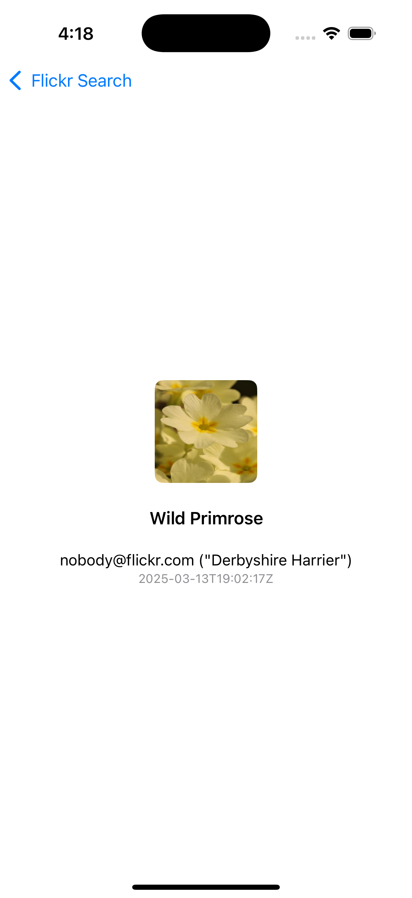

# Flickr Search App

This is a simple iOS application built using SwiftUI that allows users to search for images on Flickr. It displays search results in a grid, showing the photo thumbnails, and provides detailed information about each photo when selected.


## Features

- Search for images on Flickr by entering a keyword in the search bar.
- View image thumbnails in a responsive grid.
- Tap on an image to view detailed information, including the photo title, author, and published date.
- Asynchronous image loading with progress indicators.
- Accessibility features such as labels and hints for improved user experience.

## Screenshots

<p align="center">




</p>
## Requirements

- Xcode 12.0 or later.
- iOS 14.0 or later.

## Project Structure

### Main Components:
1. **ContentView.swift**: The main view containing the search bar and displaying the list of photos in a grid.
2. **FlickrViewModel.swift**: The view model responsible for handling the search query and fetching photos from the Flickr API.
3. **NetworkManager.swift**: A network manager that handles API requests to fetch photos from the Flickr API.
4. **FlickrPhoto.swift**: A data model representing a photo from the Flickr API.
5. **SearchBar.swift**: A custom view that displays a text field for searching images.
6. **DetailView.swift**: A view that displays detailed information about a selected photo.
7. **FlickrSearchTests.swift**: Unit tests for verifying the functionality of the app.

## How to Run the App

1. Clone the repository:

2. Open the project in Xcode.

3. Build and run the app on a simulator or physical device.

## API

The app fetches photos from the public Flickr API. The request URL is:

### Example API Response:

```json
{
    "title": "Sample Photo",
    "media": {"m": "https://example.com/photo.jpg"},
    "author": "John Doe",
    "published": "2025-03-13T10:00:00Z",
    "description": "Sample description"
}
```

## Unit Tests

The app includes unit tests for validating the parsing of Flickr photo data and verifying that the search query updates the results correctly.

### To run the tests:

1. Open the project in Xcode.
2. Press `Command + U` to run the tests.

## Accessibility

The app is designed with accessibility in mind. The following features are implemented:

- **Search Bar**: A label and hint are provided for the search bar to assist users in identifying its purpose.
- **Image Thumbnails**: Each image thumbnail has an accessibility label describing the photo's title.
- **Loading Indicators**: Accessibility labels for loading indicators to describe the app’s state.

## License

This project is licensed under the MIT License - see the [LICENSE](LICENSE) file for details.
